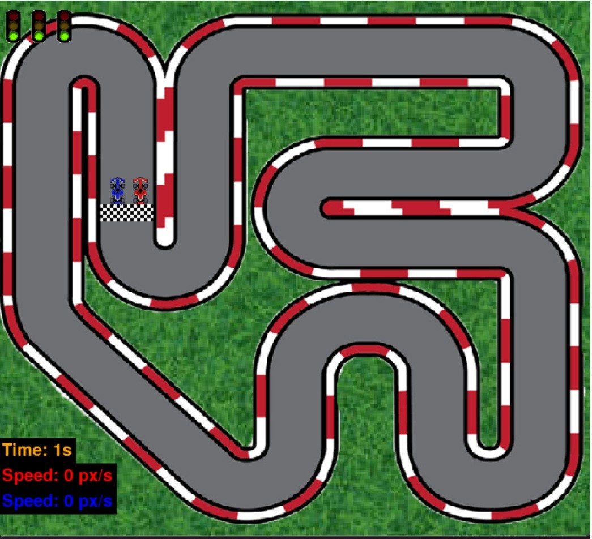

# Car Racing Game 🏎️
*A fast-paced multiplayer car racing game built using Python and Pygame*

This project was inspired by Tech With Tim. Some images and parts of the code were adapted from his tutorial

## 🚀 Features
✔️ **Multiplayer Mode** – Race against friends in an exciting head-to-head competition

✔️ **Realistic Physics** – Smooth car handling and realistic collisions for an immersive experience

✔️ **Speedometer & HUD** – Display real-time speed and race stats

## 📸 Screenshots / Preview

